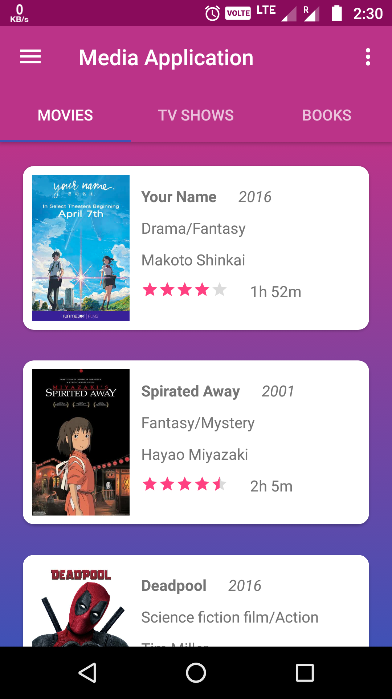
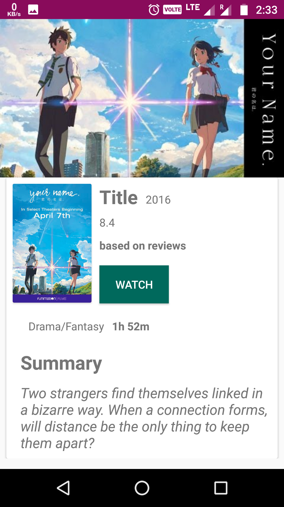
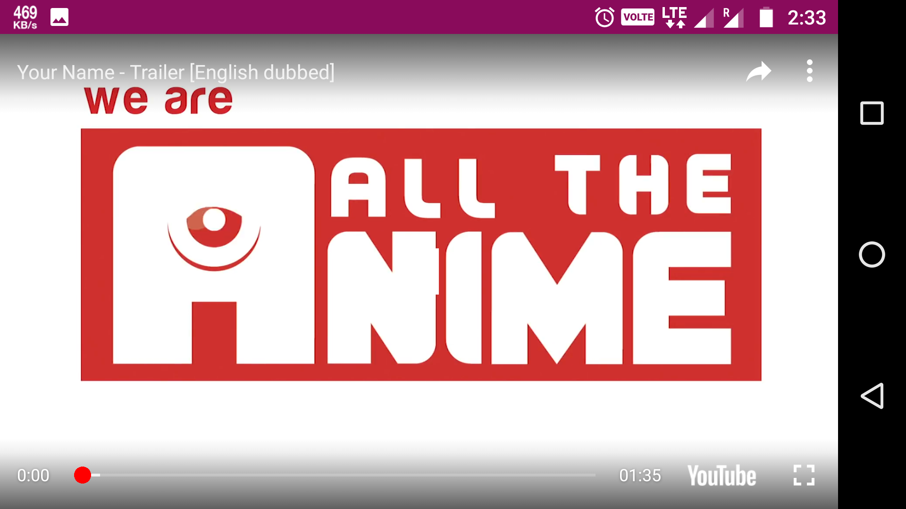
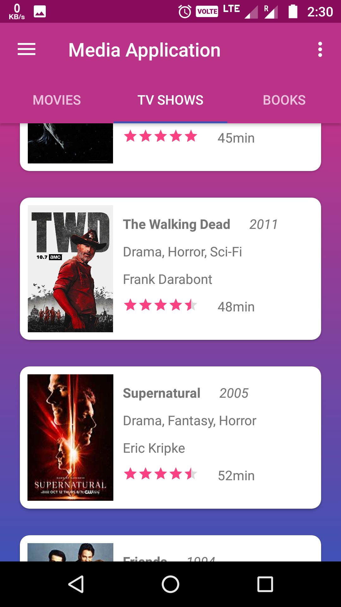
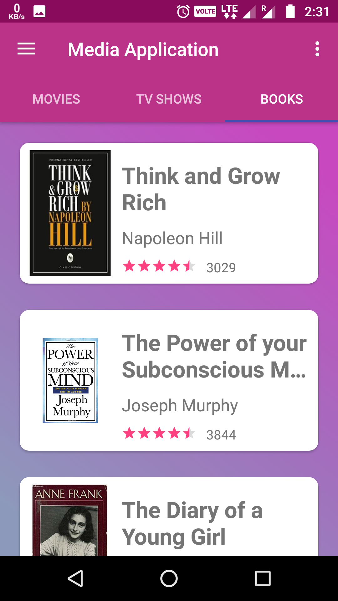
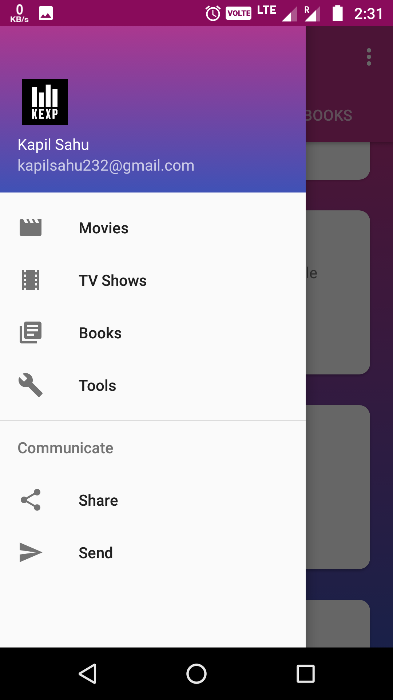

# Media-Application
This is the extended version of the movie_app. 
The API is created using Nodejs and can be found here https://github.com/kaxp/Media_App_Back-end.

The Screenshots of the app is given below.

1> The MainActivity is this, 

2> The Detailed Page is this when you click on "Your Name" Movie.

3> When Click on Watch Button  it directs you to Youtube Player.

4> This is second Fragment for the TV_Shows.

5>This is the third Fragment for the Books.

6> This is the Navigation Drawer.

